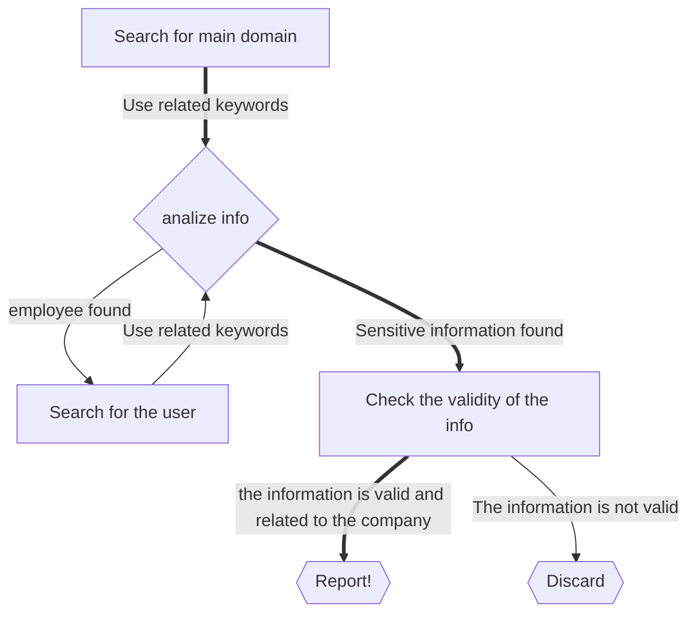

# GitHub for Bug Bounty
Service for organization and version control of projects, with github you can get to know alot of information about the company infrastructure, products they use and internal details that can be used later or in your pentest process.

##### How?
you can search for a company name or domain in the github search area to see wath projects and repos are pushed to github, and in most cases you will end up finding a thousands of results.
Example:
![[Pasted image 20220517172909.png]]

##### Tips
- Creativity is crucial to get the juicy information, you can look for services like ssh, sftp, ftp, proxy, vpn, vsphere, internal, siem, firewall ...etc, and then narrow down your search and check the code committed that might contains valuable information.
- Search results are not all for the company or uploaded by the company, it can be notes from random people, news, data gathering, recon tools, ...etc.
- Select "Recently indexed" in order to get the most recent results

# Finding sensitive information Leaks
this can be done by searching for specific keywords in github search, some keywords that might be useful are:

| Search Query                   | Description                    | Efficacy     |
| ------------------------------ | ------------------------------ | ------------ |
| "Company" password             | simple keyword search          | low          |
| "Company" secret               | simple keyword search          | low          |
| "Company" credentials          | simple keyword search          | low          |
| "Company" key                  | simple keyword search          | low          |
| "Company" pass                 | simple keyword search          | low          |
| "Company" login                | simple keyword search          | low          |
| "Company" pwd                  | simple keyword search          | low          |
| "Company" config               | simple keyword search          | low          |
| "Company" secret_key           | simple keyword search          | low          |
| "Company" mail                 | simple keyword search          | low          |
| "Company" token                | simple keyword search          | low-moderate |
| "Company" user                 | generic config                 | low-moderate |
| "Company" pass                 | generic config                 | low-moderate |
| "Company" ftp                  | simple keyword search          | low-moderate |
| "Company" vsphere              | vsphere related config         | low-moderate |
| "Company" auth                 | generic config                 | moderate     |
| "Company" nodemailer           | nodemailer config              | moderate     |
| "Company" ssh2_auth_password   | Unauthorized Access to Servers | moderate     |
| "Company" send_keys            | Password related keyword       | moderate     |
| "Company" QSqlDatabase         | Qt sql framework config        | moderate     |
| "Company" setPassword          | Qt sql password db config      | moderate     |
| "Company" send,keys            | Password related keyword       | moderate     |
| "Company" apiKey               | firebase config                | moderate     |
| "Company" databaseURL          | firebase config                | moderate     |
| "Company" storageBucket        | firebase config                | moderate     |
| "Company" authDomain           | firebase config                | moderate     |
| "Company" NetworkCredential    | email config related           | moderate     |
| "Company" db_host              | pypyodbc config                | moderate     |
| "Company" db_password          | pypyodbc config                | moderate     |
| "Company" AWS_S3_BUCKET        | aws bucket config              | moderate     |
| "Company" AWS_SECRET           | aws bucket access              | moderate     |
| "Company" security_credentials | LDAP (active directory)        | high         |
| "Company" provider_url         | LDAP (active directory)        | high         |
| "Company" connectionstring     | Database Credentials           | high         |
| "Company" JDBC                 | Java database connectivity     | high         |
| "Company" smtp                 | email server related           | high         |
| "mail.DOMAIN"                  | email server related           | high         |
| "DOMAIN" dotfiles              | new target discovery           | high         |
| "DOMAIN" language:bash         | new target discovery           | high         |

obviously you will not check for every keyword in your target, you have to first do some recon in order to get what services your target uses and so reduce the scope of the operation.

Some useful dorks to use in github are:

| Command          | Description                                          | Example                                |
| ---------------- | ---------------------------------------------------- | -------------------------------------- |
| language:KEYWORD | programming language used in the code                | language:bash "company.com" |
| NOT KEYWORD      | removes the specified keyword from the query results | password NOT 127.0.0.1                 |
| org:KEYWORD      | search for repos inside organization                 | org:teslamotors password               |
| user:KEYWORD     | search for commits made from the specified user      | user:juanito password                  |

When you find some interesting information (even if it is old) you can get some value out of it, that can be:
* Direct report (some passwords that grants third party access)
* Information about employees
* Pivot points
* Information about scope

# About the report
a valid submission must contain a proper written report explaining the leaked data impact on the company business and must be within scope. When testing the leaked credentials stop after confirmation and don't try to dig more.
If the credentials are for internal & unreachable host where you can't provide an exploitation POC you can report it but its up to the company to accept/reject the submission based on their assessment.
Avoid sending old keys, old data, dummy/test password, remember to sort the results for the most recent ones.

# About automation
there is a lot of tools that automates searching in github, one of the most popular is "[Gitrob](https://github.com/michenriksen/gitrob)", Gitrob is a tool to help find potentially sensitive files pushed to public repositories on Github. Gitrob will clone repos belonging to a user or organization down to a configurable depth and iterate through the commit history and flag files that match signatures for potentially sensitive files. The findings will be presented through a web interface for easy browsing and analysis.
[Gitrob](https://github.com/michenriksen/gitrob)

another tool that does the same but it is more up to date is [Gitleaks](https://github.com/zricethezav/gitleaks)

Automation will give you a generic group of results based on sensitivity and you have to go through them all to find what is sensitive and what's not, in manual aproach you look for specific keywords and the results are easier to manage.